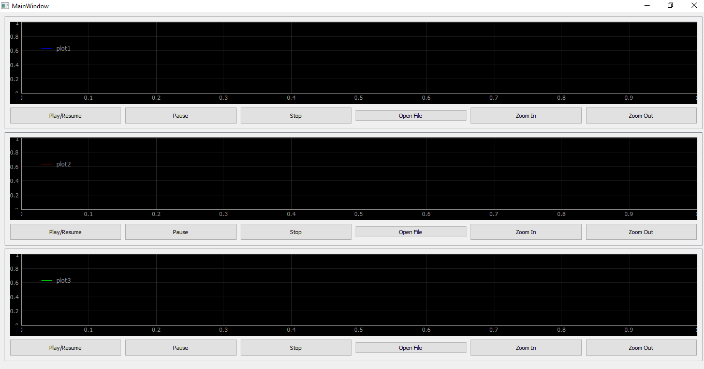
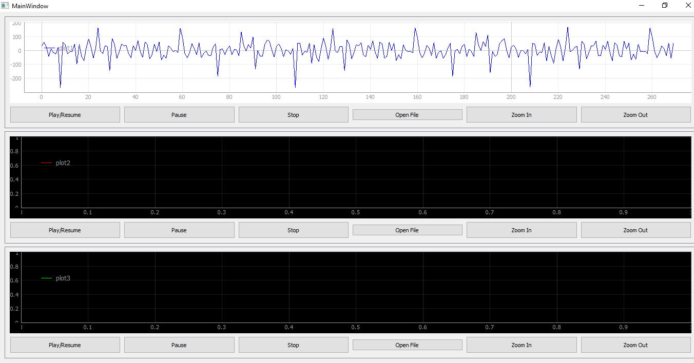

# Signal-Viewer

This repository demonstartes an implementation of a Signal Viewer app

---
As many types of data are required to be visually demonstrated in order to fully grasp what it contains of information, and as the number of these types are increasing we developed a simple app that is able to display and control the plot of these types.  

The app is able to plot a data of any type(excel, matlab, ...), it also gives the user the ability to control the plot by playing or pausing at any time, to zoom in/out, or to specifies a certain part of the graph.

The app also has many plotting windows to allow the user to plot different data at the same time in order to fully compare between them.

